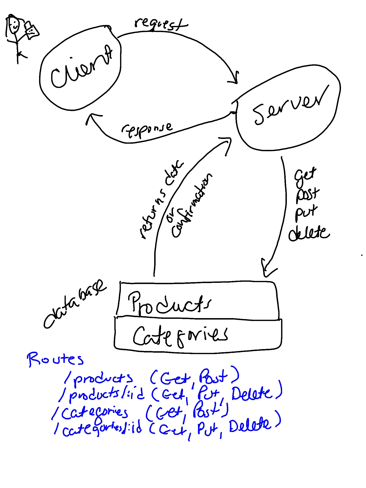

# api-server

This project contains an API server.

### Author: Marlene Rinker

- [submission PR](https://github.com/marlenerinker-401-advanced-javascript/api-server/pull/7)
<!-- - [tests report](https://github.com/marlenerinker-401-advanced-javascript/notes/actions) -->
- [Swagger Hub](https://app.swaggerhub.com/apis/marlene-rinker/api-server/0.1#/)

### Setup

#### `.env` requirements
MONGODB_ATLAS_URI=mongodb+srv://dbAdmin:<password>@cluster0-2u75g.mongodb.net/<database>?retryWrites=true&w=majority

#### Packages to Install
(see package.json)

dotenv
express
mongoose

For testing:
jest
cf-supergoose

#### Running the app
node index.js 
nodemon index.js

#### Tests
<!-- info about tests goes here -->

#### UML

